# **Quicure**

### Abstract

A major challenge in the healthcare industry is timely treatment of patients. Moreover, during the testing times of pandemic, receiving relevant observation and reservation of equipment becomes altogether laborious. Thus, giving rise to the utmost requirement of a system connecting patients to hospitals, doctors and blood banks, thereby shortening the time taken between identification and treatment which would otherwise have been the difference between life and death.
The aim of this project is to minimize the time of delayed treatment of patients and improve functional performance, quality of life and survival.

### Problem Statement

Demanding and unsparing times caused by COVID-19 pandemic have resulted in the needy not being able to access appropriate medical services. Thus, giving rise to need of creating a Health Care System, catering to the medical needs and emergencies of everyone which can result in timely treatment thus saving multiple lives.  The users must be able to find the hospitals and doctors according to their needs and be able to donate blood as well as request for it during requirements. The prime objective should be to enable users to avail medical needs in time, thus saving multiple lives.

### Quicure Software

Effective health care requires that people have timely access to it. In conflict settings, such access may be delayed, limited, or even impossible, which could result in unforeseen scenarios. Thus, giving rise to the utmost requirement of a system connecting patients to hospitals, doctors and blood banks which would eventually assist in providing timely guidance and arrangements.  
This forms the basis as well as the prime motive for creating this project, i.e. to minimize the time of delayed treatment of patients and improve functional performance, quality of life and survival.
The core functionality consists of providing the users a platform to connect with doctors, book, schedule and analyse their appointments, search for nearby hospitals, book beds and donate blood which would be highly valuable for the people urgently requiring it.

### ER/EER Diagrams

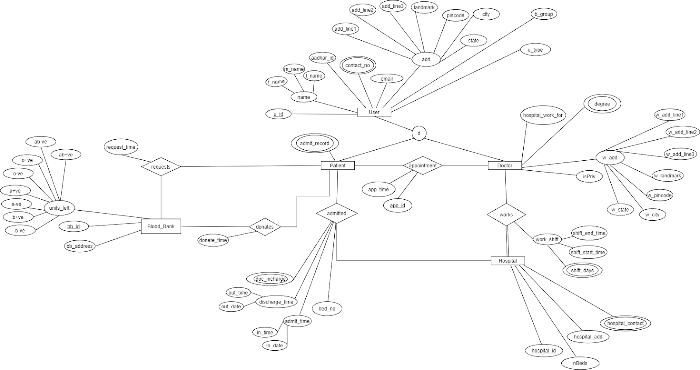

### Relational Schema

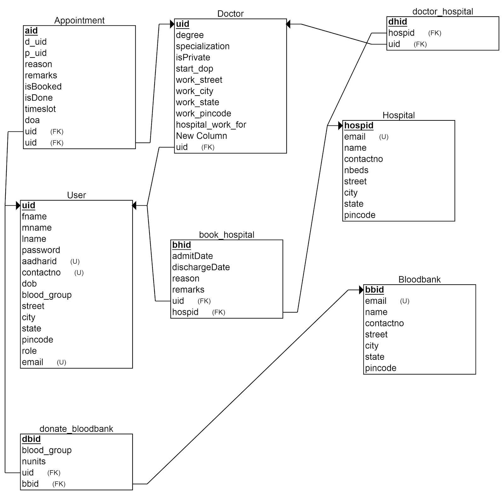

### Implementation Screenshots

#### Login

#### Register

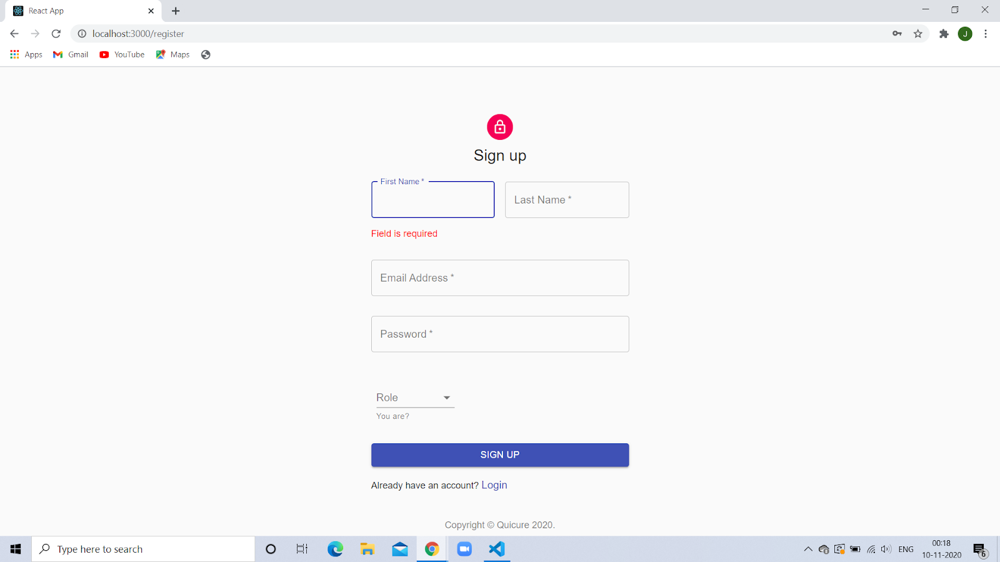

#### Home

#### All Hospitals

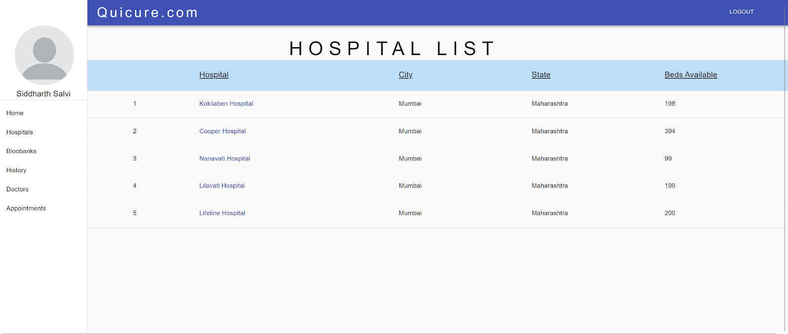

#### Hospital Bed Booking

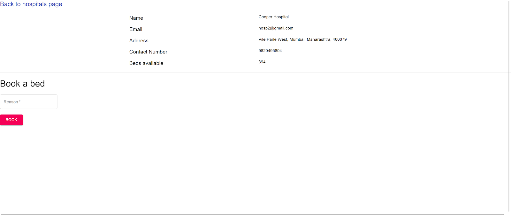

#### Hospital Booking Confirmation

#### All Bloodbanks

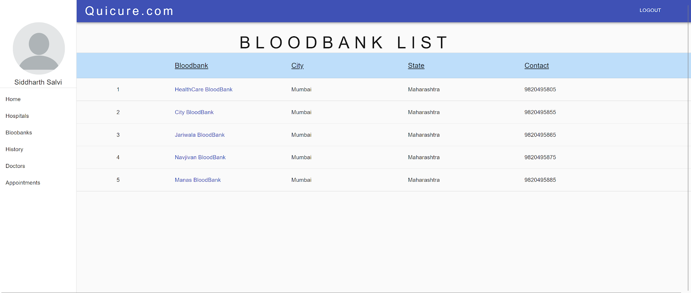

#### Donate Blood Page

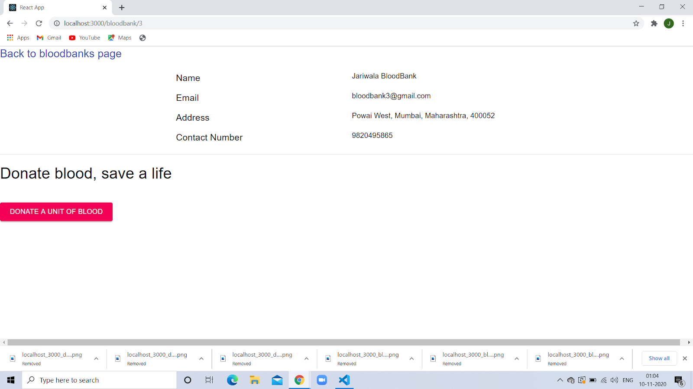

#### Blood donation confirmation

#### Doctors privately practising

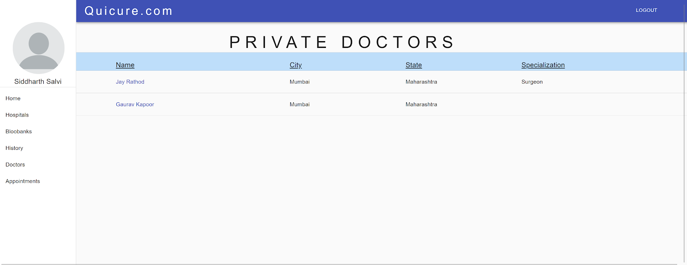

#### Appointment booking

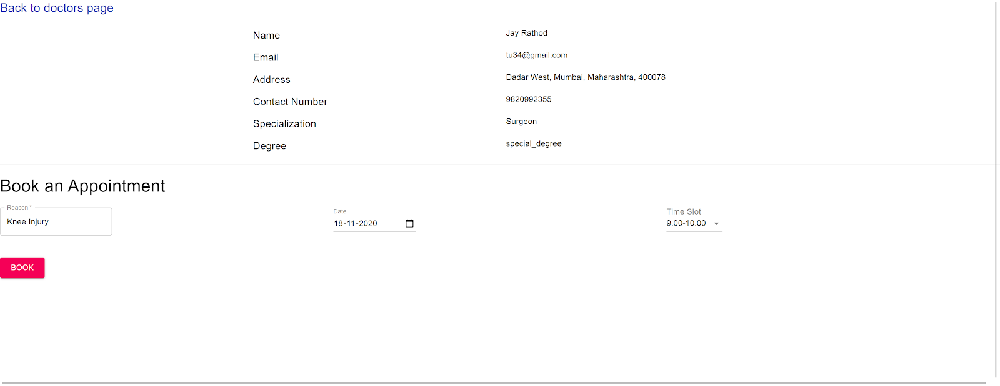

#### Appointment booking confirmation

#### All appointments

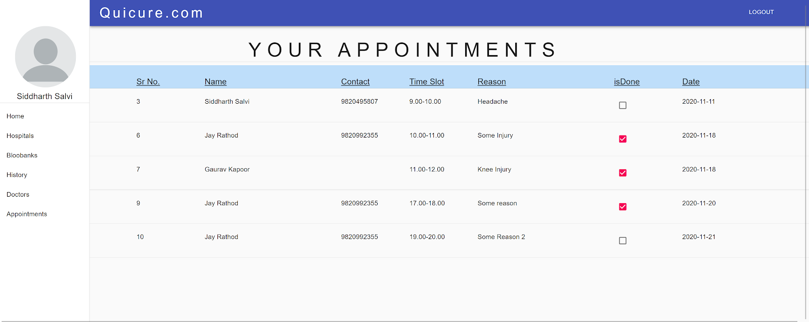

#### History Feature

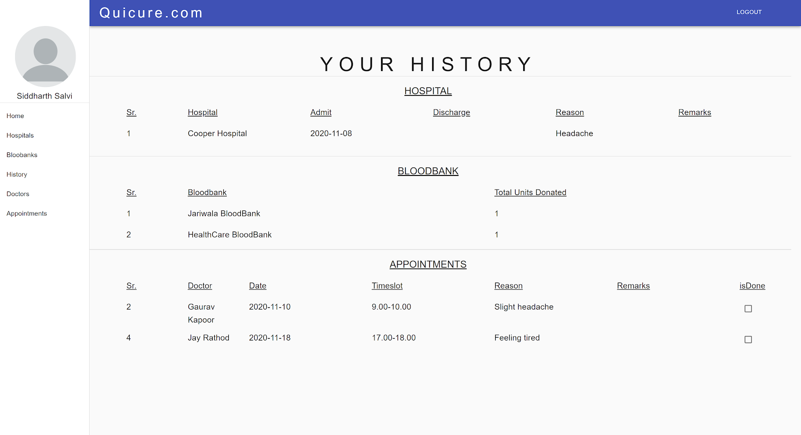

#### Regular User/Patient dashboard

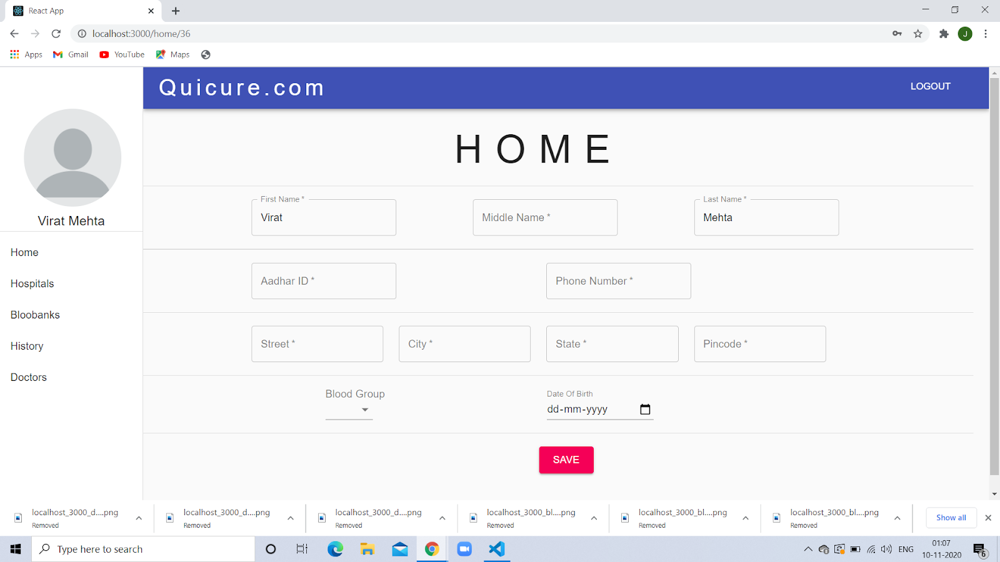

